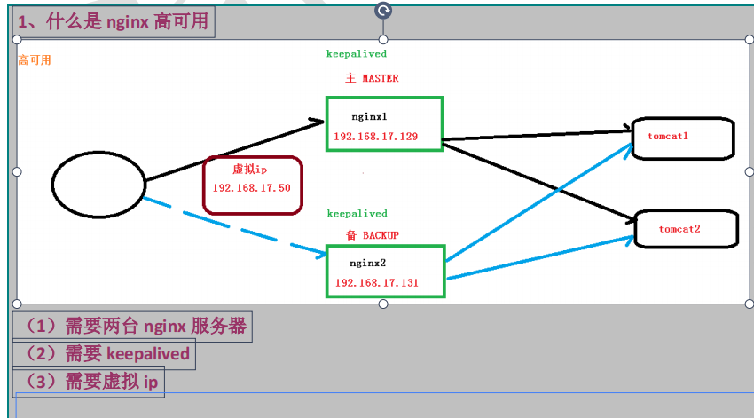

# nginx

## 简介

可以作为静态页面的 web 服务器，同时还支持 CGI 协议的动态语言，比如 perl、php
等。但是不支持 java。Java 程序只能通过与 tomcat 配合完成。Nginx 专为性能优化而开发，
性能是其最重要的考量,实现上非常注重效率 ，能经受高负载的考验,有报告表明能支持高
达 `50,000` 个并发连接数。

- 正向代理
- 反向代理
- 负责均衡
- 动静分离

## 安装 nginx

```bash
# 安装编译工具及库文件
yum -y install make zlib zlib-devel gcc-c++ libtool  openssl openssl-devel

# 安装 PCRE
# PCRE 作用是让 Nginx 支持 Rewrite 功能。
cd /usr/local/src/
wget http://downloads.sourceforge.net/project/pcre/pcre/8.37/pcre-8.37.tar.gz

# 解压安装包:
tar zxvf pcre-8.35.tar.gz

# 进入目录
cd pcre-8.37

# 编译安装
./configure
make && make install

# 查看pcre版本
pcre-config --version

# 安装 Nginx
cd /usr/local/src/
wget http://nginx.org/download/nginx-1.6.2.tar.gz

# 解压
tar zxvf nginx-1.6.2.tar.gz

# 进入目录
cd nginx-1.6.2

# 编译安装
./configure
make && make install

# 查看开放的端口号
firewall-cmd --list-all

# 设置开放的端口号
firewall-cmd --add-service=http –permanent
sudo firewall-cmd --add-port=80/tcp --permanent

# 重启防火墙
firewall-cmd –reload
```

## 常用的命令

```bash
# 版本号
/usr/local/nginx/sbin 目录下执行 ./nginx -v

# 启动
/usr/local/nginx/sbin 目录下执行 ./nginx

# 关闭命令
/usr/local/nginx/sbin 目录下执行 ./nginx -s stop

# 重新加载命令
/usr/local/nginx/sbin 目录下执行 ./nginx -s reload

#重启
/usr/local/nginx/sbin 目录下执行 ./nginx -s reopen

# 查看配置文件
cat /usr/local/webserver/nginx/conf/nginx.conf
```

## 配置文件

### 反向代理

```bash
# 全局块：从配置文件开始到 events 块之间的内容，
# 主要会设置一些影响 nginx 服务器整体运行的配置指令，主要包括配置运行 Nginx 服务器的用户（组）、
# 允许生成的 worker process 数，进程 PID 存放路径、日志存放路径和类型以及配置文件的引入等。

worker_processes 1;  # worker_processes 值越大，可以支持的并发处理量也越多
error_log /usr/local/webserver/nginx/logs/nginx_error.log crit; #日志位置和日志级别
pid /usr/local/webserver/nginx/nginx.pid;
#Specifies the value for maximum file descriptors that can be opened by this process.
worker_rlimit_nofile 65535;

# events 块涉及的指令主要影响 Nginx 服务器与用户的网络连接
events {
  use epoll;
  worker_connections 1024;  # 表示每个 worker_processes 支持的最大连接数为 1024
}

# http 块
http {
  # hppt 全局块
  include mime.types;

  server_names_hash_bucket_size 128;
  client_header_buffer_size 32k;
  large_client_header_buffers 4 32k;
  client_max_body_size 8m;

 #下面是server虚拟主机的配置
 server {
    # host文件配置 域名对应ip地址
    listen 80; # 监听端口
    server_name 192.168.3.19; # 本机ip地址

    location / {
      root html;
      proxy_pass http://127.0.0.1:8080  # tomcat 本机服务器地址
      index index.html index.htm;
    }

    # location ~ .*\.(gif|jpg|jpeg|png|bmp|swf|ico)$ {
    #   expires 30d;
    # }
    # location ~ .*\.(js|css)?$ {
    #   expires 15d;
    # }
  }

  server {
    listen 9001; # 监听端口
    server_name 192.168.3.19; # 本机ip地址

    location ~ /edu/ {
      proxy_pass http://127.0.0.1:8080  # tomcat 本机服务器地址
    }
    location ~ /vod/ {
      proxy_pass http://127.0.0.1:8081  # tomcat 本机服务器地址
    }
  }
}
```

- location 匹配

  1、= ：用于不含正则表达式的 uri 前，要求请求字符串与 uri 严格匹配，如果匹配成功，就停止继续向下搜索并立即处理该请求。
  2、~：用于表示 uri 包含正则表达式，并且区分大小写。
  3、~_：用于表示 uri 包含正则表达式，并且不区分大小写。
  4、^~：用于不含正则表达式的 uri 前，要求 Nginx 服务器找到标识 uri 和请求字
  符串匹配度最高的 location 后，立即使用此 location 处理请求，而不再使用 location
  块中的正则 uri 和请求字符串做匹配。
  注意：如果 uri 包含正则表达式，则必须要有 ~ 或者 ~_ 标识。

### 负载均衡

```bash
http {

  upstream myserver {
    serve 192.168.3.19:8080;
    serve 192.168.3.19:8081;
  }

 server {
    listen 80;
    server_name 192.168.3.19; # 本机ip地址

    location / {
      root html;
      proxy_pass http://myserver;  # tomcat 本机服务器地址
      index index.html index.htm;
    }
  }
}
```

1、轮询（默认）

每个请求按时间顺序逐一分配到不同的后端服务器，如果后端服务器 down 掉，能自动剔除。

```bash
upstream myserver {
  serve 192.168.3.19:8080;
  serve 192.168.3.19:8081;
}
```

2、weight

weight 代表权,重默认为 1,权重越高被分配的客户端越多,指定轮询几率，weight 和访问比率成正比，用于后端服务器性能不均的情况。

```bash
upstream myserver {
  serve 192.168.3.19:8080 weight=10;
  server 192.168.3.19:8081 weight=10;
}
```

3、ip_hash

每个请求按访问 ip 的 hash 结果分配，这样每个访客固定访问一个后端服务器，可以解决 session 的问题

```bash
upstream myserver {
  ip_hash;
  serve 192.168.3.19:8080;
  server 192.168.3.19:8081;
}
```

4、fair（第三方）

按后端服务器的响应时间来分配请求，响应时间短的优先分配

```bash
upstream myserver{
  serve 192.168.3.19:8080;
  server 192.168.3.19:8081;
  fair;
}
```

### 动静分离

```bash
http {

 server {
    listen 80;
    server_name 192.168.3.19; # 本机ip地址

    # 请求动态资源
    location /www/ {
      root /data/; # 根文件路径
      index index.html index.htm;
    }
    # 请求静态资源
    location /image/ {
      root /data/;
      autoindex on; # 列出文件列表
    }
  }
}
```

### 配置高可用集群

1、原理



2、配置高可用的准备工作

- 需要两台服务器 192.168.17.129 和 192.168.17.131
- 在两台服务器安装 nginx
- 在两台服务器安装 keepalived

3、在两台服务器安装 keepalived

- 使用 yum 命令进行安装
  yum install keepalived –y

- 安装之后，在 etc 里面生成目录 keepalived，有文件 keepalived.conf

- 完成高可用配置（主从配置）

  - 修改/etc/keepalived/keepalivec.conf 配置文件

```bash

  global_defs {
    notification_email {
      acassen@firewall.loc
      failover@firewall.loc
      sysadmin@firewall.loc
    }
    notification_email_from Alexandre.Cassen@firewall.loc
    smtp_server 192.168.17.129
    smtp_connect_timeout 30
    router_id LVS_DEVEL # 路由id  id在 \etc\host 文件中添加 127.0.0.1 LVS_DEVEL
  }

  vrrp_script chk_http_port {
    script "/usr/local/src/nginx_check.sh"   #  脚本位置
    interval 2 #（检测脚本执行的间隔）
    weight 2  # 当检测脚本条件成立时
  }

  vrrp_instance VI_1 {
    state BACKUP # 备份服务器上将 MASTER 改为 BACKUP
    interface ens33 //网卡
    virtual_router_id 51 # 主、备机的 virtual_router_id 必须相同
    priority 90 # 主、备机取不同的优先级，主机值较大，备份机值较小
    advert_int 1

    authentication {
      auth_type PASS
      auth_pass 1111
    }
    virtual_ipaddress {
      192.168.17.50 // VRRP H 虚拟地址
    }
  }
```

- 在/usr/local/src 添加检测脚本 nginx_check.sh

```bash
#!/bin/bash
A=`ps -C nginx –no-header |wc -l`
if [ $A -eq 0 ];then
/usr/local/nginx/sbin/nginx
sleep 2
if [ `ps -C nginx --no-header |wc -l` -eq 0 ];then
killall keepalived
fi
fi
```

- 把两台服务器上 nginx 和 keepalived 启动

  启动 nginx：./nginx

  启动 keepalived：systemctl start keepalived.service

5、最终测试

（1）在浏览器地址栏输入 虚拟 ip 地址 192.168.17.50
